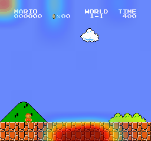
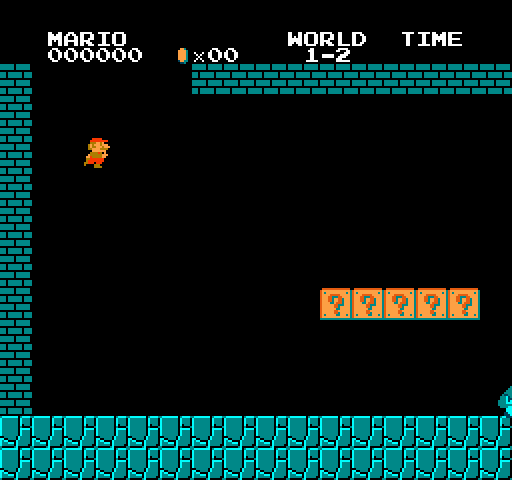
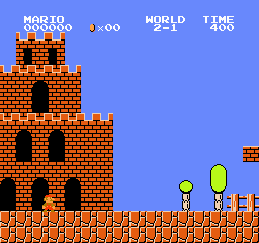
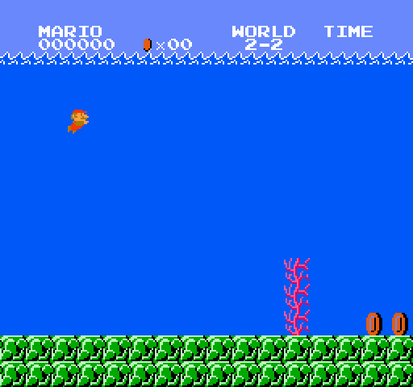
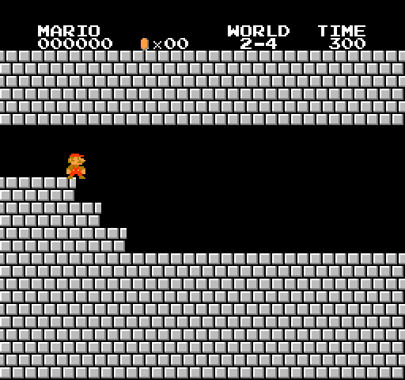
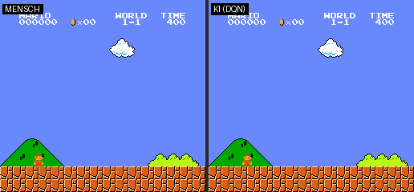
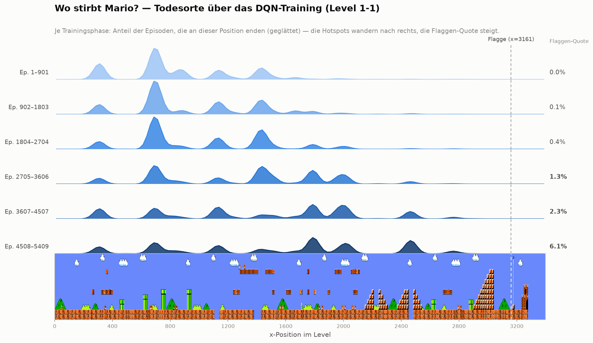

# Super Mario Bros - Reinforcement Learning

> **WIP** - Dieses Projekt befindet sich in aktiver Entwicklung.
> **Meilenstein: Welt 1 komplett!** Alle vier Level werden in **20/20 greedy-Episoden** gelöst –
> 1-1 mit Double DQN, 1-2 bis 1-4 mit PPO (Stable-Baselines3). Jedes Level brauchte dabei einen
> anderen Fix (Reward-Normalisierung, Entropie-Tuning) – Details im PPO-Abschnitt.
> Als Nächstes: ein Generalist-Modell für mehrere Level (siehe Roadmap).

Eine KI lernt Super Mario Bros zu spielen - mit Live-Fenster zum Zuschauen!




*Der trainierte Agent löst 1-1 – das rote Leuchten (Grad-CAM) zeigt, worauf das CNN pro Aktion achtet.*

## Was passiert hier?

Ein neuronales Netz lernt **Super Mario Bros nur aus den Pixeln** – und hat damit die komplette
**Welt 1 gelöst**: Level 1-1 per **Double DQN** (selbst implementiert), die härteren Level 1-2
bis 1-4 per **PPO** (Stable-Baselines3). Die KI sieht denselben Bildschirm wie ein Mensch und
lernt selbstständig zu laufen, zu springen und Gegnern auszuweichen.

**Du kannst live zuschauen**, wie Mario anfangs planlos herumläuft und nach und nach besser wird.

## Wie funktioniert es?

| Komponente | Beschreibung |
|---|---|
| **Algorithmen** | Double DQN mit Experience Replay (1-1) · PPO via Stable-Baselines3 (1-2…1-4) |
| **Input** | 4 gestapelte Graustufen-Frames (84x84) |
| **Output** | 7 Aktionen (laufen, springen, Kombos) |
| **Belohnung** | Fortschritt nach rechts, Münzen, Überleben |

```
Spielbild (240x256 RGB)
    |
    v
Vorverarbeitung (Graustufen, 84x84, 4 Frames gestapelt)
    |
    v
CNN (3x Conv + 2x FC) --> Q-Werte pro Aktion
    |
    v
Epsilon-Greedy Aktionsauswahl --> Mario bewegt sich
    |
    v
Belohnung + neuer Zustand --> Replay Memory --> Training
```

## Setup

```bash
# Repository klonen
git clone https://github.com/Spla4sH/mario-reinforcement.git
cd mario-reinforcement

# Abhängigkeiten installieren
pip install -r requirements.txt

# Training starten (öffnet Live-Spielfenster)
python train.py

# Kurzer Probelauf (z. B. zum Testen), optional ohne Fenster
python train.py --episodes 300
python train.py --episodes 300 --no-render
```

**Voraussetzungen:**
- Python 3.10+
- NVIDIA GPU mit CUDA empfohlen (CPU funktioniert, aber deutlich langsamer)

> Erster Probelauf? Folge der Checkliste in [TESTLAUF.md](TESTLAUF.md).

### Mit Docker (headless Training)

```bash
# Image bauen
docker build -t mario-rl .

# Training im Container starten (GPU durchreichen)
docker run --gpus all mario-rl python train.py --no-render --episodes 2000
```

Für den Cluster liegt unter [k8s/](k8s/) ein Kubernetes-`Job` inkl. `PersistentVolumeClaim`
(GPU-Request, Checkpoints/Logs persistent). Details & Sweep-Ideen in
[NAECHSTE_SCHRITTE.md](NAECHSTE_SCHRITTE.md) (Phase D).

### Tests & Linting

```bash
pip install -r requirements-dev.txt
ruff check .   # Linting
pytest         # Tests
```

Die Tests laufen ohne Emulator/GPU (sie prüfen Replay-Memory, Metriken, Plots,
Reward-Shaping, Greedy-Eval, Grad-CAM-Logik und die Config) und werden bei jedem
Push automatisch per [GitHub Actions](.github/workflows/ci.yml) ausgeführt.

### Experiment-Tracking (optional, Weights & Biases)

```bash
pip install wandb && wandb login
USE_WANDB=1 python train.py --no-render
```

Loggt Live-Metriken (Reward, x-Position, Epsilon, Loss) und die Greedy-Eval in ein
**W&B-Dashboard** – ideal, um Trainingsläufe zu vergleichen und Hyperparameter-Sweeps
auszuwerten. Ist `wandb` nicht installiert oder `USE_WANDB` nicht gesetzt, läuft das
Training unverändert ohne Tracking weiter.

## Projektstruktur

```
mario-reinforcement/
├── train.py          # Hauptskript - DQN-Training mit Live-Anzeige
├── train_ppo.py      # PPO-Training (Stable-Baselines3, separates venv, s. requirements-ppo.txt)
├── mario_ppo_env.py  # Gymnasium-Brücke (shimmy) für PPO
├── goexplore.py      # Savestate-Suche gegen Hard-Exploration-Stellen (Go-Explore-Idee)
├── imitate.py        # Demo aufnehmen + Behavior Cloning (bc / bc-seq)
├── human_vs_ki.py    # Eigenen Lauf aufnehmen + Side-by-Side-GIF gegen den Agenten
├── play.py           # Trainierten Agenten greedy zuschauen (Originalbild)
├── play_ppo.py       # PPO-Agenten live zuschauen (auch Zwischenstände)
├── visualize.py      # KI-Vision-Overlay (Grad-CAM) - was sieht die KI?
├── app.py            # Gradio-Live-Demo (KI-Vision im Browser)
├── record.py         # Episode als GIF aufnehmen (Auto-Highlight + Demo)
├── agent.py          # Double DQN Agent + Replay Memory
├── model.py          # CNN-Architektur
├── wrappers.py       # Bildvorverarbeitung & Environment-Wrapper
├── reward.py         # Reward-Shaping (Skalierung/Clipping)
├── evaluate.py       # Greedy-Evaluation (flag_get-Rate, x-Position)
├── metrics.py        # CSV-Logging der Trainingsmetriken
├── plot.py           # Graphen aus den Metriken erzeugen
├── tracking.py       # Optionales W&B-Experiment-Tracking (ausfallsicher)
├── config.py         # Hyperparameter (per Env-Variablen überschreibbar)
├── tests/            # pytest-Suite
├── Dockerfile        # Headless-Training als Container
├── k8s/              # Kubernetes Job + PersistentVolume
├── deploy/           # Hugging Face Space (requirements/packages) – siehe DEPLOY.md
├── .github/          # GitHub-Actions-CI (Lint + Tests)
└── requirements.txt
```

## PPO-Agent: Welt 1 komplett (Stable-Baselines3)



*Der PPO-Agent löst Level 1-2 – das Level, an dem Double DQN scheiterte. Training:
`train_ppo.py` (separates venv, siehe `requirements-ppo.txt`).*

| Level | Algorithmus | Greedy-Eval | Der entscheidende Hebel |
|---|---|---|---|
| 1-1 | Double DQN | **20/20** 🏁 | langer Trainingslauf (~5.250 Episoden) |
| 1-2 | PPO | **20/20** 🏁 | **Reward-Normalisierung + LR-Decay** (vanilla-PPO oszillierte 5M Steps lang) |
| 1-3 | PPO | **20/20** 🏁 | **Entropie-Bonus 0.01→0.03** (Policy war in lokalem Optimum eingerastet) |
| 1-4 | PPO | **20/20** 🏁 | Rezept aus 1-2/1-3 reichte direkt (Schloss/Feuerstäbe) |

**Generalist-Experiment:** Ein *einziges* PPO-Modell, auf allen vier Leveln gleichzeitig trainiert
(15M Steps, parallele Envs round-robin über die Level):

| Level | Generalist (1 Modell) | Anmerkung |
|---|---|---|
| 1-1 | **20/20** 🏁 | fiel erst durch Verlängerung 10M→15M |
| 1-2 | 0/20 (x 3055 ≈ 95 %) | strandet kurz vor dem Ausgang |
| 1-3 | 0/20 (x 783) | dieselbe Lücke wie einst DQN – 15M Steps ohne Bewegung |
| 1-4 | **20/20** 🏁 | |

Ehrliches Ergebnis: **Multi-Task kostet** – zwei Level löst das eine Modell, an den
Präzisionsstellen der anderen beiden verliert es gegen die Spezialisten. Interessantes Detail:
Der aggregierte Trainings-Reward wirkte über die letzten 5M Steps flach, während 1-1 darunter
von 0/20 auf 20/20 kippte – Mittelwerte über Level verstecken per-Level-Fortschritt.

Jedes Level zeigte eine andere RL-„Krankheit" mit eigenem Gegenmittel: **Instabilität →
Reward-Normalisierung**, **vorzeitige Konvergenz → mehr Entropie**. Die Diagnosen sind in
den Trainingskurven (`runs_ppo/`, TensorBoard) nachvollziehbar.

## Welt 2 komplett: Hard Exploration am Trampolin-Turm



*Level 2-1, gelöst: 20/20 greedy-Episoden Flagge. Der Sprung über den Turm am Ende ist ein
Trampolin-„Superbounce" – die Stelle, an der reines RL 12 Millionen Steps lang scheiterte.*

| Level | Ergebnis | Der entscheidende Hebel |
|---|---|---|
| 2-1 | **20/20** 🏁 | **Savestate-Suche (Go-Explore-Idee) + Behavior Cloning** – s. unten |
| 2-2 (Wasser) | **20/20** 🏁 | Standard-Rezept + **Kurven-Diagnose**: nach 3M Steps 0/20, aber Reward stieg noch → Resume +3M statt Methodenwechsel |
| 2-3 (Brücken) | **20/20** 🏁 | Standard-Rezept, 3M Steps, erster Anlauf – fliegende Cheep-Cheeps waren kein Problem |
| 2-4 (Schloss) | **20/20** 🏁 | Standard-Rezept, 3M Steps, erster Anlauf – bis zur Axt hinter Bowser |

Die Stelle ist ein klassisches **Hard-Exploration-Problem**: Die Policy erreicht den Turm
zuverlässig, aber der Abprall-Sprung ist eine so unwahrscheinliche Aktionsfolge, dass
Zufalls-Exploration sie nie würfelt – jede Probe kostet einen kompletten Level-Anlauf.
Was alles *nicht* half: 12M Steps PPO, Entropie-Boosts, Behavior Cloning einer menschlichen
Demo (Distribution Shift), sogar ein Wechsel der Aktions-Taktung (`FRAME_SKIP` 4→2).

Die Lösung (`goexplore.py`, inspiriert von [Go-Explore](https://arxiv.org/abs/1901.10995)):
**Zustand sichern statt immer neu anlaufen.** Die Policy spielt bis kurz vor den Turm, der
NES-Emulator-Zustand wird gesichert, dann werden tausende zufällige Aktionssequenzen direkt
ab dem Savestate getestet – Kandidat 81 fand den Superbounce bis zur Flagge. Diese
Lösungssequenz wird per `imitate.py bc-seq` in die Policy geklont; da der Anlauf ihr
eigenes greedy-Verhalten ist, gibt es keinen Distribution Shift, und das deterministische
Env macht die Reproduktion exakt.

Nebenbefund mit Lehrwert: Eine erste Probe mit 45 *handgeskripteten* Sprungvarianten legte
nahe, der Sprung sei bei 4-Frame-Taktung physikalisch unmöglich. Die breite Zufallssuche
widerlegte das – die Hypothese war ein Artefakt des zu engen Suchraums.



***2-2** war der Gegenbeweis, dass nicht jede Hürde ein Spezialwerkzeug braucht: Nach 3M Steps
strandeten alle Greedy-Episoden an einem Gegner bei x&nbsp;2563 – aber die Trainingskurve stieg
noch. Also kein Methodenwechsel, sondern Resume um weitere 3M Steps → 20/20. Die Schwimm-Physik
(A-Taste = Schwimmstoß statt Sprung) lernte PPO ohne jede Anpassung aus den Pixeln.*



*Das Welt-Finale: 2-3 und 2-4 fielen mit dem Standard-Rezept jeweils im ersten Anlauf –
Feuerstäbe, Lava und Bowser inklusive. Faustregel aus Welt 2: **steigt die Trainingskurve
noch, weitertrainieren; friert sie bei einem festen x ein, ist es ein Explorationsproblem →
`goexplore.py`.***

## Mensch vs. KI



*Gleiches Level, gleiche 7 Aktionen – links Mensch, rechts der trainierte DQN-Agent.
Beide erreichen die Flagge, die KI ist rund 25 Spielsekunden schneller (Restzeit 329 vs. 304).
Eigenen Lauf aufnehmen: `python human_vs_ki.py record`, dann `compose`.*

## Analyse: Wo stirbt Mario?



*Todespositionen aus 5.409 DQN-Trainingsepisoden (Level 1-1), aufgeteilt in sechs
Trainingsphasen. Früh dominiert das Rohr-Cluster (x&nbsp;600–900), in der Mitte wird die
Grube bei x&nbsp;≈&nbsp;1450 zum Hotspot, später wandern die Tode immer weiter nach rechts –
während die Flaggen-Quote (rechte Spalte) von 0&nbsp;% auf 6&nbsp;% steigt. Man sieht dem
Agenten beim Lernen zu: Das Level wird von links nach rechts „erobert".*

## Zuschauen & Auswerten

```bash
# Einem trainierten Agenten live im Original-Spielbild zuschauen (kein Training)
python play.py --episodes 5

# Graphen aus der neuesten Trainings-CSV erzeugen (logs/ -> plots/)
python plot.py
```

### KI-Vision: Was sieht die KI? (Grad-CAM)

```bash
# Heatmap-Overlay live anzeigen – rot = wichtig für die gewählte Aktion
python visualize.py --episodes 2

# Zusätzlich als GIF speichern (z. B. für dieses README)
python visualize.py --episodes 1 --save vision.gif
```

Per **Grad-CAM** wird der letzte Convolution-Layer ausgewertet und als Heatmap über
das Original-Spielbild gelegt. So wird sichtbar, **welche Bildregionen** (Gegner, Lücken,
Plattformen) die Entscheidung des Netzes gerade antreiben – ein direkter Blick „in den Kopf"
des Agenten.

### Live-Demo im Browser (Gradio)

```bash
pip install gradio
python app.py        # öffnet eine lokale Web-Demo
```

Eine **Gradio-App** lässt den trainierten Agenten auf Knopfdruck spielen und zeigt den Lauf
inkl. Grad-CAM-Overlay direkt im Browser – ohne Installation für den Betrachter. Deploybar als
**Hugging Face Space** (CPU-Inferenz genügt), ideal als klickbarer Portfolio-Link.
Schritt-für-Schritt-Anleitung: [DEPLOY.md](DEPLOY.md) (Dateien liegen in [deploy/](deploy/)).

> **Auto-Highlight:** Während des Trainings wird bei jedem neuen Bestmodell automatisch die beste
> Episode als `highlights/best_run.gif` gespeichert – fertige Portfolio-Assets ohne Handarbeit.

Während des Trainings werden alle Metriken pro Episode nach `logs/run_*.csv`
geschrieben und bei jedem Checkpoint automatisch als Graph nach `plots/` geplottet.
Die ROM ist im Paket `gym-super-mario-bros` enthalten – es muss nichts separat
heruntergeladen werden.

## Konfiguration

In `config.py` lassen sich alle Hyperparameter anpassen:

| Parameter | Default | Beschreibung |
|---|---|---|
| `RENDER` | `True` | Live-Spielfenster anzeigen |
| `LEARNING_RATE` | `0.00025` | Lernrate |
| `EPSILON_DECAY` | `100.000` | Schritte bis Exploration minimal |
| `GAMMA` | `0.99` | Discount Factor |
| `MEMORY_SIZE` | `100.000` | Größe des Replay Buffers |

## Roadmap

- [x] Double DQN Agent
- [x] Live-Rendering des Original-Spiels
- [x] Checkpoint-System (Pause & Fortsetzen)
- [x] Trainingsmetriken & Graphen
- [x] Wiedergabe-Modus für trainierte Agenten (`play.py`)
- [x] **Level 1-1 konsistent abschließen** – 20/20 greedy-Episoden erreichen die Flagge (Kriterium ≥ 80 %)
- [x] **Level 1-2 mit PPO gelöst** – 20/20 greedy-Episoden Flagge (DQN scheiterte hier; Details unten)
- [x] **Welt 1 komplett** – auch 1-3 und 1-4 mit PPO gelöst (je 20/20)
- [x] Generalist-Experiment: ein Modell für alle Welt-1-Level (löst 2 von 4, Details oben)
- [x] **Level 2-1 gelöst** – Hard-Exploration-Stelle per Savestate-Suche + Behavior Cloning geknackt
- [x] **Welt 2 komplett** – 2-2 (Wasser), 2-3 (Brücken) und 2-4 (Schloss) je 20/20
- [ ] Alle Welten durchspielen
- [ ] Vortrainiertes Modell bereitstellen

### Vision / Weiterentwicklung

- [x] **KI-Vision-Overlay** (Grad-CAM) – sichtbar machen, worauf das CNN achtet
- [x] Containerisierung: Docker-Image + Kubernetes-Job für headless Training
- [x] Tests + CI (pytest, ruff, GitHub Actions)
- [x] Reward-Shaping + Greedy-Evaluation (Basis für „1-1 konsistent")
- [x] Experiment-Tracking mit Weights & Biases (optional)
- [x] Live-Demo (Gradio) + Auto-Highlight-GIF des besten Laufs
- [x] Algorithmus-Upgrade: Double DQN → **PPO** (Stable-Baselines3 + shimmy) – löst 1-2, wo DQN scheiterte
- [ ] Generalisierung: zweite Umgebung (Atari) über dieselbe Pixel-Pipeline
- [ ] MLOps-Ausbau: Hyperparameter-Sweeps als parallele K8s-Jobs

Detaillierter Fahrplan: [NAECHSTE_SCHRITTE.md](NAECHSTE_SCHRITTE.md).

## Technologien

- [gym-super-mario-bros](https://github.com/Kautenja/gym-super-mario-bros) - NES-Emulator als Gym-Umgebung
- [PyTorch](https://pytorch.org/) - Neuronales Netz & Training (DQN)
- [Stable-Baselines3](https://stable-baselines3.readthedocs.io/) + [shimmy](https://shimmy.farama.org/) - PPO auf der Legacy-Gym-Umgebung
- [OpenCV](https://opencv.org/) - Bildvorverarbeitung

## Entwicklung

Die Architektur- und Design-Entscheidungen (Double DQN, Reward-Strategie, Roadmap)
stammen von mir. Die Umsetzung entstand AI-assistiert mit [Claude Code](https://claude.com/claude-code)
als Pair-Programmer – entsprechende Beiträge sind in der Git-History per
`Co-Authored-By` ausgewiesen.
