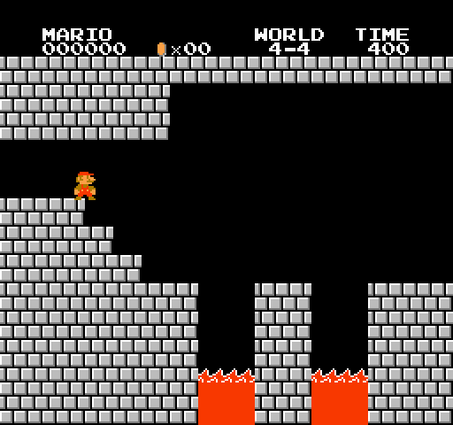
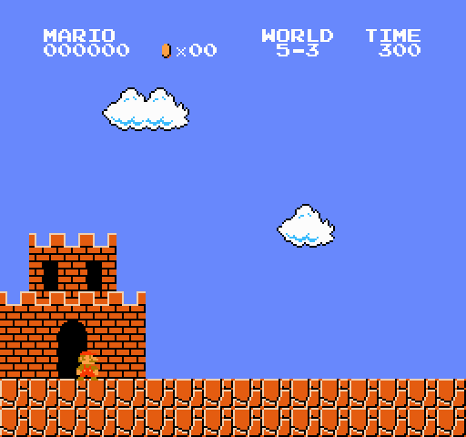
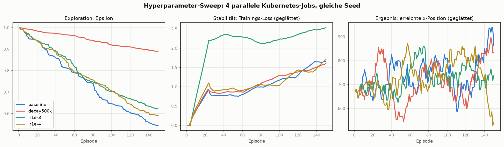
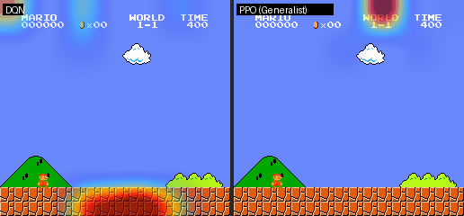

# Super Mario Bros - Reinforcement Learning

> 🏁 **Welt 1–6 komplett — alle 24 angegangenen Level gelöst.** Jedes Level erfüllt das
> vorab definierte Erfolgskriterium **20/20 greedy-Episoden bis zur Flagge**: 1-1 mit
> selbst implementiertem Double DQN, alle übrigen mit PPO – und für die Stellen, an denen
> reines RL scheiterte, jeweils ein eigenes Werkzeug: eine Go-Explore-Savestate-Suche
> (Trampolin-Turm in 2-1, Labyrinth in 4-4, samt einer echten Reward-Hacking-Geschichte)
> und **Transfer Learning** zwischen baugleichen Leveln (5-3). Die Details erzählen die
> Welt-Abschnitte weiter unten.

Eine KI lernt Super Mario Bros zu spielen – mit Live-Fenster zum Zuschauen!

**🍄 [Live-Demo im Browser ausprobieren →](https://huggingface.co/spaces/Spl4sH/mario-reinforcement)** (Hugging Face Space, inkl. Grad-CAM-Overlay)


*Der trainierte Agent löst 1-1 – das rote Leuchten (Grad-CAM) zeigt, worauf das CNN pro Aktion achtet.*

## Was passiert hier?

Ein neuronales Netz lernt **Super Mario Bros nur aus den Pixeln** – und hat damit
**alle 24 Level der Welten 1–6 gelöst**: Level 1-1 per **Double DQN** (selbst
implementiert), alle übrigen per **PPO** (Stable-Baselines3). Die KI sieht denselben
Bildschirm wie ein Mensch und lernt selbstständig zu laufen, zu springen und Gegnern
auszuweichen – niemand sagt ihr, *wie* man spielt, nur dass rechts gut ist und
Sterben schlecht.

**Du kannst live zuschauen**, wie Mario anfangs planlos herumläuft und nach und nach besser wird.

## Wie funktioniert es?

| Komponente | Beschreibung |
|---|---|
| **Algorithmen** | Double DQN mit Experience Replay (1-1) · PPO via Stable-Baselines3 (alle übrigen Level) |
| **Input** | 4 gestapelte Graustufen-Frames (84x84) |
| **Output** | 7 Aktionen (laufen, springen, Kombos) |
| **Belohnung** | Fortschritt nach rechts − Zeitstrafe − Todesstrafe |

```
Spielbild (240x256 RGB)
    |
    v
Vorverarbeitung (Graustufen, 84x84, 4 Frames gestapelt)
    |
    v
CNN (3x Conv + 2x FC) --> Q-Werte pro Aktion
    |
    v
Epsilon-Greedy Aktionsauswahl --> Mario bewegt sich
    |
    v
Belohnung + neuer Zustand --> Replay Memory --> Training
```

## Setup

```bash
# Repository klonen
git clone https://github.com/Spla4sH/mario-reinforcement.git
cd mario-reinforcement

# Abhängigkeiten installieren
pip install -r requirements.txt

# Training starten (öffnet Live-Spielfenster)
python train.py

# Kurzer Probelauf (z. B. zum Testen), optional ohne Fenster
python train.py --episodes 300
python train.py --episodes 300 --no-render
```

**Voraussetzungen:**
- Python 3.10+
- NVIDIA GPU mit CUDA empfohlen (CPU funktioniert, aber deutlich langsamer)

> **Ohne eigenes Training loslegen:** Alle 24 trainierten Modelle gibt es als Release
> ([v1.0](https://github.com/Spla4sH/mario-reinforcement/releases/tag/v1.0) = Welt 1–4,
> [v1.1](https://github.com/Spla4sH/mario-reinforcement/releases/tag/v1.1) = Welt 5,
> [v1.2](https://github.com/Spla4sH/mario-reinforcement/releases/tag/v1.2) = Welt 6) –
> `mario_best.pt` nach `checkpoints/`, die `.zip`-Modelle nach `checkpoints_ppo/` legen,
> dann direkt `python play.py` bzw. `python play_ppo.py --model … --world … --stage …`.

> Erster Probelauf? Folge der Checkliste in [TESTLAUF.md](TESTLAUF.md).

### Mit Docker (headless Training)

```bash
# Image bauen
docker build -t mario-rl .

# Training im Container starten (GPU durchreichen)
docker run --gpus all mario-rl python train.py --no-render --episodes 2000
```

Für den Cluster liegt unter [k8s/](k8s/) ein Kubernetes-`Job` inkl. `PersistentVolumeClaim`
(GPU-Request, Checkpoints/Logs persistent) – und der
[Hyperparameter-Sweep](#mlops-hyperparameter-sweep-als-parallele-kubernetes-jobs) weiter
unten wurde damit real ausgeführt.

### Tests & Linting

```bash
pip install -r requirements-dev.txt
ruff check .   # Linting
pytest         # Tests
```

Die Tests laufen ohne Emulator/GPU (sie prüfen Replay-Memory, Metriken, Plots,
Reward-Shaping, Greedy-Eval, Grad-CAM-Logik und die Config) und werden bei jedem
Push automatisch per [GitHub Actions](.github/workflows/ci.yml) ausgeführt.

### Experiment-Tracking (optional, Weights & Biases)

```bash
pip install wandb && wandb login
USE_WANDB=1 python train.py --no-render
```

Loggt Live-Metriken (Reward, x-Position, Epsilon, Loss) und die Greedy-Eval in ein
**W&B-Dashboard** – ideal, um Trainingsläufe zu vergleichen und Hyperparameter-Sweeps
auszuwerten. Ist `wandb` nicht installiert oder `USE_WANDB` nicht gesetzt, läuft das
Training unverändert ohne Tracking weiter.

## Projektstruktur

```
mario-reinforcement/
├── train.py          # Hauptskript - DQN-Training mit Live-Anzeige
├── train_ppo.py      # PPO-Training (Stable-Baselines3, separates venv, s. requirements-ppo.txt)
├── mario_ppo_env.py  # Gymnasium-Brücke (shimmy) für PPO
├── goexplore.py      # Savestate-Suche gegen Hard-Exploration-Stellen (Go-Explore-Idee)
├── imitate.py        # Demo aufnehmen + Behavior Cloning (bc / bc-seq)
├── human_vs_ki.py    # Eigenen Lauf aufnehmen + Side-by-Side-GIF gegen den Agenten
├── play.py           # Trainierten Agenten greedy zuschauen (Originalbild)
├── play_ppo.py       # PPO-Agenten live zuschauen (auch Zwischenstände)
├── visualize.py      # KI-Vision-Overlay (Grad-CAM) - was sieht die KI?
├── visualize_ppo.py  # Dasselbe für PPO (SB3-CnnPolicy) - DQN-vs-PPO-Vergleich
├── app.py            # Gradio-Demo: 24 Level im Browser (Dropdown + Grad-CAM-Toggle)
├── gen_demos.py      # Vorberechnete Demo-MP4s + results.json für den HF-Space erzeugen
├── eval_ppo.py       # Greedy-Eval eines PPO-Modells (Flaggen-Rate über N Episoden)
├── gif_ppo.py        # Deterministische PPO-Episode als GIF (README-Assets)
├── record.py         # Episode als GIF aufnehmen (Auto-Highlight + Demo)
├── death_map.py      # „Wo stirbt Mario?"-Grafik: Todes-Dichten über Level-Panorama
├── agent.py          # Double DQN Agent + Replay Memory
├── model.py          # CNN-Architektur
├── wrappers.py       # Bildvorverarbeitung & Environment-Wrapper
├── reward.py         # Reward-Shaping (Skalierung/Clipping)
├── evaluate.py       # Greedy-Evaluation (flag_get-Rate, x-Position)
├── metrics.py        # CSV-Logging der Trainingsmetriken
├── plot.py           # Graphen aus den Metriken erzeugen
├── sweep_plot.py     # Sweep-Varianten vergleichen (Epsilon/Loss/x-Position)
├── tracking.py       # Optionales W&B-Experiment-Tracking (ausfallsicher)
├── config.py         # Hyperparameter (per Env-Variablen überschreibbar)
├── tests/            # pytest-Suite
├── Dockerfile        # Headless-Training als Container
├── k8s/              # Kubernetes: Trainings-Job, Hyperparameter-Sweep, Reader-Pod
├── deploy/           # Hugging Face Space (statische Demo-App) – siehe DEPLOY.md
├── .github/          # GitHub-Actions-CI (Lint + Tests)
└── requirements.txt
```

## PPO-Agent: Welt 1 komplett (Stable-Baselines3)


*Der PPO-Agent löst Level 1-2 – das Level, an dem Double DQN scheiterte. Training:
`train_ppo.py` (separates venv, siehe `requirements-ppo.txt`).*

| Level | Algorithmus | Greedy-Eval | Der entscheidende Hebel |
|---|---|---|---|
| 1-1 | Double DQN | **20/20** 🏁 | langer Trainingslauf (~5.250 Episoden) |
| 1-2 | PPO | **20/20** 🏁 | **Reward-Normalisierung + LR-Decay** (vanilla-PPO oszillierte 5M Steps lang) |
| 1-3 | PPO | **20/20** 🏁 | **Entropie-Bonus 0.01→0.03** (Policy war in lokalem Optimum eingerastet) |
| 1-4 | PPO | **20/20** 🏁 | Rezept aus 1-2/1-3 reichte direkt (Schloss/Feuerstäbe) |

**Generalist-Experiment:** Ein *einziges* PPO-Modell, auf allen vier Leveln gleichzeitig trainiert
(15M Steps, parallele Envs round-robin über die Level):

| Level | Generalist (1 Modell) | Anmerkung |
|---|---|---|
| 1-1 | **20/20** 🏁 | fiel erst durch Verlängerung 10M→15M |
| 1-2 | 0/20 (x 3055 ≈ 95 %) | strandet kurz vor dem Ausgang |
| 1-3 | 0/20 (x 783) | dieselbe Lücke wie einst DQN – 15M Steps ohne Bewegung |
| 1-4 | **20/20** 🏁 | |

Ehrliches Ergebnis: **Multi-Task kostet** – zwei Level löst das eine Modell, an den
Präzisionsstellen der anderen beiden verliert es gegen die Spezialisten. Interessantes Detail:
Der aggregierte Trainings-Reward wirkte über die letzten 5M Steps flach, während 1-1 darunter
von 0/20 auf 20/20 kippte – Mittelwerte über Level verstecken per-Level-Fortschritt.

Jedes Level zeigte eine andere RL-„Krankheit" mit eigenem Gegenmittel: **Instabilität →
Reward-Normalisierung**, **vorzeitige Konvergenz → mehr Entropie**. Die Diagnosen sind in
den Trainingskurven (`runs_ppo/`, TensorBoard) nachvollziehbar.

## Welt 2 komplett: Hard Exploration am Trampolin-Turm


*Level 2-1, gelöst: 20/20 greedy-Episoden Flagge. Der Sprung über den Turm am Ende ist ein
Trampolin-„Superbounce" – die Stelle, an der reines RL 12 Millionen Steps lang scheiterte.*

| Level | Ergebnis | Der entscheidende Hebel |
|---|---|---|
| 2-1 | **20/20** 🏁 | **Savestate-Suche (Go-Explore-Idee) + Behavior Cloning** – s. unten |
| 2-2 (Wasser) | **20/20** 🏁 | Standard-Rezept + **Kurven-Diagnose**: nach 3M Steps 0/20, aber Reward stieg noch → Resume +3M statt Methodenwechsel |
| 2-3 (Brücken) | **20/20** 🏁 | Standard-Rezept, 3M Steps, erster Anlauf – fliegende Cheep-Cheeps waren kein Problem |
| 2-4 (Schloss) | **20/20** 🏁 | Standard-Rezept, 3M Steps, erster Anlauf – bis zur Axt hinter Bowser |

Die Stelle ist ein klassisches **Hard-Exploration-Problem**: Die Policy erreicht den Turm
zuverlässig, aber der Abprall-Sprung ist eine so unwahrscheinliche Aktionsfolge, dass
Zufalls-Exploration sie nie würfelt – jede Probe kostet einen kompletten Level-Anlauf.
Was alles *nicht* half: 12M Steps PPO, Entropie-Boosts, Behavior Cloning einer menschlichen
Demo (Distribution Shift), sogar ein Wechsel der Aktions-Taktung (`FRAME_SKIP` 4→2).

Die Lösung (`goexplore.py`, inspiriert von [Go-Explore](https://arxiv.org/abs/1901.10995)):
**Zustand sichern statt immer neu anlaufen.** Die Policy spielt bis kurz vor den Turm, der
NES-Emulator-Zustand wird gesichert, dann werden tausende zufällige Aktionssequenzen direkt
ab dem Savestate getestet – Kandidat 81 fand den Superbounce bis zur Flagge. Diese
Lösungssequenz wird per `imitate.py bc-seq` in die Policy geklont; da der Anlauf ihr
eigenes greedy-Verhalten ist, gibt es keinen Distribution Shift, und das deterministische
Env macht die Reproduktion exakt.

Nebenbefund mit Lehrwert: Eine erste Probe mit 45 *handgeskripteten* Sprungvarianten legte
nahe, der Sprung sei bei 4-Frame-Taktung physikalisch unmöglich. Die breite Zufallssuche
widerlegte das – die Hypothese war ein Artefakt des zu engen Suchraums.


***2-2** war der Gegenbeweis, dass nicht jede Hürde ein Spezialwerkzeug braucht: Nach 3M Steps
strandeten alle Greedy-Episoden an einem Gegner bei x&nbsp;2563 – aber die Trainingskurve stieg
noch. Also kein Methodenwechsel, sondern Resume um weitere 3M Steps → 20/20. Die Schwimm-Physik
(A-Taste = Schwimmstoß statt Sprung) lernte PPO ohne jede Anpassung aus den Pixeln.*


*Das Welt-Finale: 2-3 und 2-4 fielen mit dem Standard-Rezept jeweils im ersten Anlauf –
Feuerstäbe, Lava und Bowser inklusive. Faustregel aus Welt 2: **steigt die Trainingskurve
noch, weitertrainieren; friert sie bei einem festen x ein, ist es ein Explorationsproblem →
`goexplore.py`.***

## Welt 3 komplett: viermal Standard-Rezept

| Level | Ergebnis | Der entscheidende Hebel |
|---|---|---|
| 3-1 (Nacht) | **20/20** 🏁 | Standard-Rezept, 3M Steps, erster Anlauf |
| 3-2 | **20/20** 🏁 | Standard-Rezept, 3M Steps, erster Anlauf |
| 3-3 (Baumwipfel) | **20/20** 🏁 | Standard-Rezept, 3M Steps, erster Anlauf |
| 3-4 (Schloss) | **20/20** 🏁 | Standard-Rezept, 3M Steps, erster Anlauf |

Welt 3 brauchte **keinerlei Sonderbehandlung** mehr – die in Welt 1/2 erarbeitete Pipeline
(PPO + VecNormalize + LR-Decay, 16 Envs, 3M Steps, Greedy-Eval als Kriterium) löst ein neues
Level inzwischen in ~40 Minuten Training. **Zwischenstand: 12 von 12 angegangenen Leveln
gelöst** (Welt 1–3, je 20/20 greedy).

## Welt 4 komplett: Reward-Hacking im Labyrinth



*Level 4-4, gelöst: 20/20 greedy-Episoden bis zur Axt (x 2772). Das unscheinbare Labyrinth
war das härteste Level des Projekts – es brauchte zwei Reward-Fixes und eine mehrstufige
Savestate-Suche.*

| Level | Ergebnis | Der entscheidende Hebel |
|---|---|---|
| 4-1 | **20/20** 🏁 | Standard-Rezept, 3M Steps, erster Anlauf |
| 4-2 | **20/20** 🏁 | Standard-Rezept, 3M Steps, erster Anlauf |
| 4-3 | **20/20** 🏁 | Standard-Rezept, 3M Steps, erster Anlauf |
| 4-4 (Labyrinth) | **20/20** 🏁 | **Reward-Fix gegen zwei Exploits + mehrstufiges Go-Explore + Behavior Cloning** – s. unten |

**4-4 wurde zur lehrreichsten Etappe des Projekts – der Agent hat den Reward zweimal
ausgetrickst (Reward-Hacking):**

1. **Loop-Farming:** 4-4 ist ein Labyrinth – falsche Wege werfen Mario zurück, und das Env
   setzt den Reward großer x-Rücksprünge auf 0. Im-Kreis-Laufen kostet also nichts, bringt
   aber jede Runde erneut Fortschritts-Reward. Der Agent lief endlos im Kreis: **13.824
   Reward bei 0 % Flagge.** Fix: ein `ProgressReward`-Wrapper, der nur *neue* x-Maxima belohnt.
2. **16-Bit-Overflow:** Danach farmte der Agent einen Emulator-Glitch, bei dem `x_pos` beim
   Screen-Übergang kurz auf 65535 springt – **57k Reward** für einen Integer-Überlauf. Fix:
   nur physikalisch plausible Schritte zählen (0 < Δx ≤ 64 px/Frame).

Beide Fixes wurden **vorab am Exploit-Modell gemessen** (13.824 → 1.574 bzw. 64.735 → 221),
bevor neue Rechenzeit investiert wurde. Derselbe Glitch täuschte später übrigens ein drittes
Mal – als falscher „Durchbruch" in der Savestate-Suche, die daraufhin denselben
Plausibilitäts-Deckel bekam.

Mit sauberem Reward blieb 4-4 trotzdem ungelöst (eingefroren bei x 1433): Der richtige Weg
durchs Labyrinth ist ein **Hard-Exploration-Problem** – der entscheidende Check sitzt am
Screen-Übergang x ≈ 2048, wer auf dem falschen Pfad ankommt, wird zurückgeworfen. Gelöst hat
es die **mehrstufige Go-Explore-Suche** (`goexplore.py --head-seq`): Stufe 1 fand ab einem
Savestate bei x 902 den Weg an der Weiche vorbei (ab x 1106 war er *unerreichbar* – der
Savestate der ersten Suche lag 200 px zu spät), Stufe 2 setzte auf der gefundenen Sequenz auf
und fand die Axt hinter Bowser. Die Gesamtsequenz (495 Aktionen) wurde per `imitate.py bc-seq`
in die Policy geklont – mit einer letzten Lektion: Nicht die Imitations-Trefferquote zählt,
sondern der Greedy-Lauf selbst; die Flagge kam in Epoche 65 bei „nur" 97,2 % Trefferquote,
seither wird jede Epoche greedy verifiziert und der beste Stand behalten.

## Welt 5 komplett: als ein Modell aus Welt 1 die Lösung brachte



*Level 5-3, gelöst: Genau dieser Sprung über die Lücke war die Wand, an der vier Ansätze
scheiterten – bis ein Modell aus Welt 1 ihn auf Anhieb konnte.*

| Level | Ergebnis | Der entscheidende Hebel |
|---|---|---|
| 5-1 | **20/20** 🏁 | Standard-Rezept + **Resume auf 6M Steps** (nach 3M erst 0/20, aber Kurve stieg noch) |
| 5-2 | **20/20** 🏁 | dasselbe: 3M → 0/20 bei x 2380, Resume +3M → Flagge |
| 5-3 (Baumwipfel) | **20/20** 🏁 | **Transfer Learning vom 1-3-Modell** – vier andere Ansätze scheiterten (s. unten) |
| 5-4 (Schloss) | **20/20** 🏁 | Standard-Rezept, 3M Steps, erster Anlauf |

Bilanz: Welt 5 braucht meist **kein neues Werkzeug, aber das doppelte Trainingsbudget**
(6M statt 3M Steps) – die Level sind länger und dichter. Die Faustregel aus Welt 2 hat
sich erneut bewährt: *Kurve steigt noch → weitertrainieren, nicht die Methode wechseln.*

**5-3 war die lehrreichste Etappe – und ein Wiedersehen mit einem alten Bekannten.** Der
Agent fror bei **exakt x 783** ein, derselben Stelle, an der schon Level **1-3** scheiterte:
Nintendo hat die Baumwipfel-Level aus demselben Layout-Baustein gebaut. Man kann die
Wiederverwendung von Level-Design also an den Trainingskurven ablesen. Vier Ansätze
scheiterten nacheinander, bevor der fünfte in Sekunden gewann:

| Ansatz | Ergebnis |
|---|---|
| 6M Steps Standard-Training | x 783 |
| Entropie-Boost (`ent_coef` 0.03 – hatte 1-3 geheilt) | x 783, Kurve 2,3M Steps flach |
| Go-Explore-Savestate-Suche, 32.000 Kandidaten | kein Durchbruch |
| 168 systematisch geskriptete Sprungvarianten | alle tödlich (max x 747) |
| **1-3-Modell einfach 5-3 spielen lassen** | **x 1606 auf Anhieb** → Feintuning → 20/20 🏁 |

Drei Lehren aus dieser Nacht:

1. **Ein bewährtes Rezept ist eine Hypothese, kein Gesetz.** Der Entropie-Bonus, der 1-3
   heilte, war bei 5-3 wirkungslos – die Kurve entscheidet, nicht die Analogie.
2. **Mehr Suche half nicht, Hinschauen schon.** 12.000 Kandidaten landeten alle exakt bei
   x 783. Erst ein Screenshot plus der y-Verlauf zeigte: Mario springt schon bei x ≈ 645
   ab und fällt in eine Lücke – der Savestate lag *hinter* dem Point of no Return, jeder
   Kandidat war beim Start bereits im freien Fall. (Dieselbe Lektion wie in 4-4.)
3. **Der dritte Metrik-Exploit – diesmal im eigenen Suchcode.** Mit früherem Savestate
   meldete die Suche „Durchbruch: x 914" – der Kandidat war jedoch **tot**. Beim Sturz
   läuft `x_pos` weiter hoch, weil Mario im Fall nach vorn fliegt; damit gewinnt ein
   *tieferer Sturz* gegen jeden sicheren Stand. Nach Loop-Farming und 16-Bit-Overflow war
   es diesmal kein Agent, sondern **die eigene Suchfunktion**, die die Lücke zwischen
   Metrik und Absicht fand. Fix: Kandidaten, die ohne Flagge sterben, zählen nicht.

Und die eigentliche Pointe: **Transfer schlägt Suche.** Ein Modell, das eine Struktur
schon kennt, löst sie sofort – dort, wo Millionen zufälliger Versuche vergeblich blieben.
Seitdem hat die Diagnose-Faustregel einen dritten Zweig: *Kurve steigt → weitertrainieren;
Kurve friert ein → goexplore; **kenne ich ein gelöstes Level mit ähnlicher Struktur? →
erst dessen Policy probieren.***

## Welt 6 komplett: Routine – und ein lehrreicher Fehlschlag

| Level | Ergebnis | Der entscheidende Hebel |
|---|---|---|
| 6-1 | **20/20** 🏁 | Standard-Rezept, 3M Steps, erster Anlauf |
| 6-2 | **20/20** 🏁 | 3M → 0/20 bei x 2665, Kurve stieg noch → Resume +3M |
| 6-3 (Baumwipfel) | **20/20** 🏁 | 6M Steps am Stück – **Transfer wurde getestet und verworfen** |
| 6-4 (Schloss) | **20/20** 🏁 | Standard-Rezept, 3M Steps, erster Anlauf |

Welt 6 brauchte **kein einziges Spezialwerkzeug** – die Pipeline aus fünf Welten Erfahrung
löst ein Level inzwischen im Schnitt in unter einer Stunde. Interessant ist trotzdem 6-3,
weil dort ein **Zwei-Minuten-Test eine falsche Hypothese widerlegte**: Nach dem
Transfer-Erfolg in 5-3 lag nahe, dass alle „X-3"-Level denselben Baumwipfel-Baustein
teilen. Also erst getestet, bevor Rechenzeit floss – die vorhandenen Modelle auf 6-3
losgelassen:

| Modell | Weite in 6-3 |
|---|---|
| `mario_ppo_5-3.zip` | x 406 |
| `mario_ppo_1-3_ent03.zip` | x 395 |
| `mario_ppo_4-3.zip` | x 282 |

Alle scheiterten früh – **6-3 ist kein Zwilling**, nur derselbe *Leveltyp*. Damit ist die
Faustregel präzisiert: *Transfer wirkt bei baugleichen Leveln, nicht bei bloß ähnlichem
Leveltyp.* Der Test kostete zwei Minuten und ersparte einen aussichtslosen Transferlauf –
frisches Training mit 6M Steps am Stück löste 6-3 dann problemlos.

## Mensch vs. KI


*Gleiches Level – links Mensch, rechts der trainierte DQN-Agent. Beide erreichen die
Flagge, die KI ist rund 25 Spielsekunden schneller (Restzeit 329 vs. 304).*

Eigenen Lauf aufnehmen und antreten – **gegen jedes der 24 gelösten Level**. Der Mensch
spielt dabei mit **voller Original-Steuerung** (alle NES-Kombos inkl. Ducken und
Links-Sprung), der Agent hat weiterhin nur seine 7 Aktions-Kombos:

```bash
# 1. Selbst spielen – ein Terminal-Menü fragt das Level ab (1-1 … 4-4).
#    Steuerung: WASD = laufen/ducken, Leertaste/O = springen, Shift/P = rennen;
#    ESC beendet. Aufgenommen wird ab der ersten Eingabe bis Tod oder Flagge.
python human_vs_ki.py record

# 2. Side-by-Side-GIF bauen – dasselbe Menü wählt auch das passende Modell
#    (1-1 = DQN; alle PPO-Level im .venv-ppo ausführen):
python human_vs_ki.py compose
```

Level und Modell lassen sich auch explizit setzen (`--world/--stage/--ppo`), dann
entfällt das Menü – Details im Skript-Docstring.

## Analyse: Wo stirbt Mario?


*Todespositionen aus 5.409 DQN-Trainingsepisoden (Level 1-1) als Dichtekurven je
Trainingsphase – gezeichnet **über einem Panorama des Levels**, das aus einem
Greedy-Lauf des fertigen Agenten zusammengesetzt ist (Kameraposition pro Frame aus dem
NES-RAM). So sieht man direkt, *woran* Mario stirbt: Früh liegt der große Berg auf der
Rohrgruppe, in der Mitte werden die Gruben zum Hotspot, später wandern die Tode zu den
Gegner-Clustern und der Endtreppe – während die Flaggen-Quote (rechts) von 0&nbsp;% auf
6&nbsp;% steigt. Man sieht dem Agenten beim Lernen zu: Das Level wird von links nach
rechts „erobert". Erzeugt mit `death_map.py`.*

## MLOps: Hyperparameter-Sweep als parallele Kubernetes-Jobs



*Vier Trainingsläufe mit unterschiedlichen Hyperparametern — als **vier parallele
Kubernetes-Jobs** in einem lokalen [kind](https://kind.sigs.k8s.io/)-Cluster ausgeführt,
gleiche Seed, Varianten per Env-Variablen (`LEARNING_RATE`, `EPSILON_DECAY`). Ergebnis links
nach rechts: Der **Epsilon-Verlauf** zeigt den Mechanismus der `decay500k`-Variante (5×
langsamerer Explorations-Abbau), der **Loss** entlarvt die zu hohe Lernrate `lr1e-3` (~3×
höher, zappelig), die **x-Position** ist nach 150 CPU-Episoden ehrlich gesagt noch
verrauschte Frühphase — der Punkt des Sweeps ist der Vergleich, nicht das Lösen.*

```bash
docker build -t mario-rl .                      # Image (Dockerfile im Repo)
kind create cluster --name mario                # lokaler K8s-Cluster (1 Container)
kind load docker-image mario-rl:latest --name mario
kubectl apply -f k8s/sweep-jobs.yaml            # 4 Jobs + PVC
kubectl get pods -l sweep=mario -w              # zuschauen
# danach: Ergebnisse einsammeln + Vergleichsplot
kubectl apply -f k8s/reader-pod.yaml && kubectl wait --for=condition=Ready pod/mario-sweep-reader
kubectl cp mario-sweep-reader:/data/logs ./sweep_results
python sweep_plot.py --dir sweep_results --out sweep.png
```

Der Weg dahin war lehrreicher als das Ergebnis (Details in den Manifest-Kommentaren):
ein **24-GB-Build-Kontext** (`.dockerignore` muss mitwachsen), ein fehlender C++-Compiler
(*runtime*- vs. *devel*-Basis-Image), und ein **OOMKilled** — der DQN-Replay-Buffer wächst
auf ~6 GB, vier Jobs überbuchten die Docker-VM, und das Memory-Limit hat genau das getan,
wofür es da ist: den einen Ausreißer töten statt den ganzen Node. Auf einem echten
GPU-Cluster: `nvidia.com/gpu`-Limit ergänzen (siehe `k8s/train-job.yaml`) und Episoden
hochdrehen.

## Zuschauen & Auswerten

```bash
# Einem trainierten Agenten live im Original-Spielbild zuschauen (kein Training)
python play.py --episodes 5

# Graphen aus der neuesten Trainings-CSV erzeugen (logs/ -> plots/)
python plot.py
```

### KI-Vision: Was sieht die KI? (Grad-CAM)

```bash
# Heatmap-Overlay live anzeigen – rot = wichtig für die gewählte Aktion
python visualize.py --episodes 2

# Zusätzlich als GIF speichern (z. B. für dieses README)
python visualize.py --episodes 1 --save vision.gif
```

Per **Grad-CAM** wird der letzte Convolution-Layer ausgewertet und als Heatmap über
das Original-Spielbild gelegt. So wird sichtbar, **welche Bildregionen** (Gegner, Lücken,
Plattformen) die Entscheidung des Netzes gerade antreiben – ein direkter Blick „in den Kopf"
des Agenten.

#### DQN vs. PPO: zwei Algorithmen, zwei Blickweisen



*Beide Agenten lösen 1-1 – aber sie schauen unterschiedlich hin: Das **DQN** konzentriert
seine Aufmerksamkeit punktuell auf den Boden direkt vor Mario, das **PPO**-Modell (der
Welt-1-Generalist) verteilt sie auf Objekte – ?-Blöcke, Gegner, Geländekanten – mit einem
diffuseren Grundpegel. Nebenbefund: PPO erreicht die Flagge ~25 % schneller. PPO-Variante:*

```bash
# PPO-Vision (im .venv-ppo; --no-window für headless GIF-Export)
python visualize_ppo.py --model checkpoints_ppo/mario_ppo_gen_welt1.zip --episodes 1
```

### Live-Demo im Browser (Gradio)

```bash
pip install gradio
python app.py        # öffnet eine lokale Web-Demo
```

Eine **Gradio-App** zeigt jeden der **24 gelösten Level** im Browser – Dropdown zur
Level-Auswahl (1‑1 DQN, Rest PPO), Checkbox für das Grad-CAM-Overlay, Lauf bis zur Flagge.
Lokal (`python app.py`) rechnet die App live; der öffentliche Space zeigt **vorberechnete
Videos** (per `gen_demos.py` erzeugt).

**➡️ Live ausprobieren: [huggingface.co/spaces/Spl4sH/mario-reinforcement](https://huggingface.co/spaces/Spl4sH/mario-reinforcement)** 🍄

*Warum vorberechnet? Zwei Gründe, beide lehrreich: (1) Die Gratis-CPU des Space ist zu langsam,
um eine Episode live zu rechnen und als Video zu bauen. (2) Auf fremder Hardware **divergiert
die deterministische Trajektorie** – gleiche Gewichte, aber andere BLAS-Rundung → ein knapper
argmax kippt → der Agent strandet z. B. in 1‑1 bei x ≈ 2914 statt an der Flagge. Vorberechnete
Läufe (auf trainierter Hardware, bis zur Flagge) zeigen jedem Besucher denselben sauberen Lauf.
„Deterministisch gelöst" gilt eben pro Maschine.*
Schritt-für-Schritt-Anleitung: [DEPLOY.md](DEPLOY.md) (Dateien liegen in [deploy/](deploy/)).

> **Auto-Highlight:** Während des Trainings wird bei jedem neuen Bestmodell automatisch die beste
> Episode als `highlights/best_run.gif` gespeichert – fertige Portfolio-Assets ohne Handarbeit.

Während des Trainings werden alle Metriken pro Episode nach `logs/run_*.csv`
geschrieben und bei jedem Checkpoint automatisch als Graph nach `plots/` geplottet.
Die ROM ist im Paket `gym-super-mario-bros` enthalten – es muss nichts separat
heruntergeladen werden.

## Konfiguration

In `config.py` lassen sich alle Hyperparameter anpassen:

| Parameter | Default | Beschreibung |
|---|---|---|
| `RENDER` | `True` | Live-Spielfenster anzeigen |
| `LEARNING_RATE` | `0.00025` | Lernrate |
| `EPSILON_DECAY` | `100.000` | Schritte bis Exploration minimal |
| `GAMMA` | `0.99` | Discount Factor |
| `MEMORY_SIZE` | `100.000` | Größe des Replay Buffers |

## Roadmap

- [x] Double DQN Agent
- [x] Live-Rendering des Original-Spiels
- [x] Checkpoint-System (Pause & Fortsetzen)
- [x] Trainingsmetriken & Graphen
- [x] Wiedergabe-Modus für trainierte Agenten (`play.py`)
- [x] **Level 1-1 konsistent abschließen** – 20/20 greedy-Episoden erreichen die Flagge (Kriterium ≥ 80 %)
- [x] **Level 1-2 mit PPO gelöst** – 20/20 greedy-Episoden Flagge (DQN scheiterte hier; Details oben)
- [x] **Welt 1 komplett** – auch 1-3 und 1-4 mit PPO gelöst (je 20/20)
- [x] Generalist-Experiment: ein Modell für alle Welt-1-Level (löst 2 von 4, Details oben)
- [x] **Level 2-1 gelöst** – Hard-Exploration-Stelle per Savestate-Suche + Behavior Cloning geknackt
- [x] **Welt 2 komplett** – 2-2 (Wasser), 2-3 (Brücken) und 2-4 (Schloss) je 20/20
- [x] **Welt 3 komplett** – alle vier Level 20/20, jeweils im ersten Anlauf
- [x] **Welt 4 komplett** – 4-1/4-2/4-3 im ersten Anlauf; 4-4 (Labyrinth) nach zweifachem
  Reward-Hacking-Fix per mehrstufigem Go-Explore + Behavior Cloning
- [x] **Welt 6 komplett** – alle vier Level 20/20, ohne Spezialwerkzeug;
  bei 6-3 wurde ein Transfer getestet und begründet verworfen
- [x] **Welt 5 komplett** – alle vier Level 20/20; 5-3 per **Transfer Learning** vom
  baugleichen Level 1-3 gelöst, nachdem vier andere Ansätze scheiterten
- [ ] Alle Welten durchspielen
- [x] **Vortrainierte Modelle bereitgestellt** – alle 24 Level + Welt-1-Generalist als
  Release [v1.0](https://github.com/Spla4sH/mario-reinforcement/releases/tag/v1.0) (Welt 1–4),
  [v1.1](https://github.com/Spla4sH/mario-reinforcement/releases/tag/v1.1) (Welt 5)
  und [v1.2](https://github.com/Spla4sH/mario-reinforcement/releases/tag/v1.2) (Welt 6)

### Vision / Weiterentwicklung

- [x] **KI-Vision-Overlay** (Grad-CAM) – sichtbar machen, worauf das CNN achtet
- [x] Containerisierung: Docker-Image + Kubernetes-Job für headless Training
- [x] Tests + CI (pytest, ruff, GitHub Actions)
- [x] Reward-Shaping + Greedy-Evaluation (Basis für „1-1 konsistent")
- [x] Experiment-Tracking mit Weights & Biases (optional)
- [x] Live-Demo (Gradio) als Hugging Face Space – **alle 24 gelösten Level** im Browser
  (Dropdown + Grad-CAM-Toggle, vorberechnete Videos)
- [x] Algorithmus-Upgrade: Double DQN → **PPO** (Stable-Baselines3 + shimmy) – löst 1-2, wo DQN scheiterte
- [x] Grad-CAM für PPO (`visualize_ppo.py`) + DQN-vs-PPO-Vergleichs-GIF
- [x] **MLOps-Ausbau: Hyperparameter-Sweep als parallele K8s-Jobs** – real ausgeführt
  (kind-Cluster, 4 Varianten, Vergleichsplot; inkl. gelebter OOMKilled-Lektion)
- [ ] Generalisierung: zweite Umgebung (Atari) über dieselbe Pixel-Pipeline

Detaillierter Fahrplan: [NAECHSTE_SCHRITTE.md](NAECHSTE_SCHRITTE.md).

## Technologien

- [gym-super-mario-bros](https://github.com/Kautenja/gym-super-mario-bros) - NES-Emulator als Gym-Umgebung
- [PyTorch](https://pytorch.org/) - Neuronales Netz & Training (DQN)
- [Stable-Baselines3](https://stable-baselines3.readthedocs.io/) + [shimmy](https://shimmy.farama.org/) - PPO auf der Legacy-Gym-Umgebung
- [OpenCV](https://opencv.org/) - Bildvorverarbeitung

## Entwicklung

Die Architektur- und Design-Entscheidungen (Double DQN, Reward-Strategie, Roadmap)
stammen von mir. Die Umsetzung entstand AI-assistiert mit [Claude Code](https://claude.com/claude-code)
als Pair-Programmer – entsprechende Beiträge sind in der Git-History per
`Co-Authored-By` ausgewiesen.
